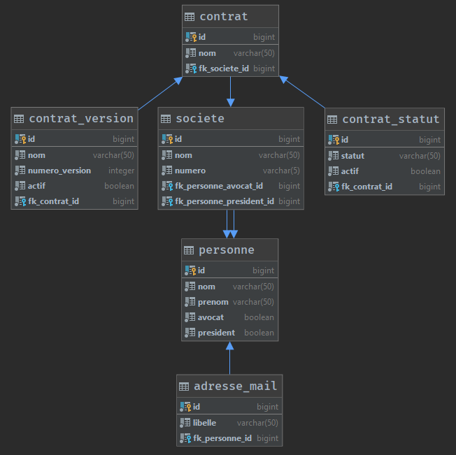
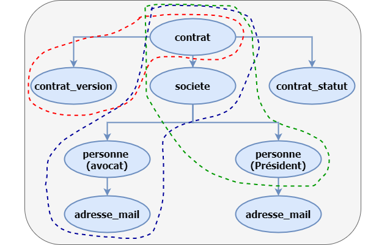
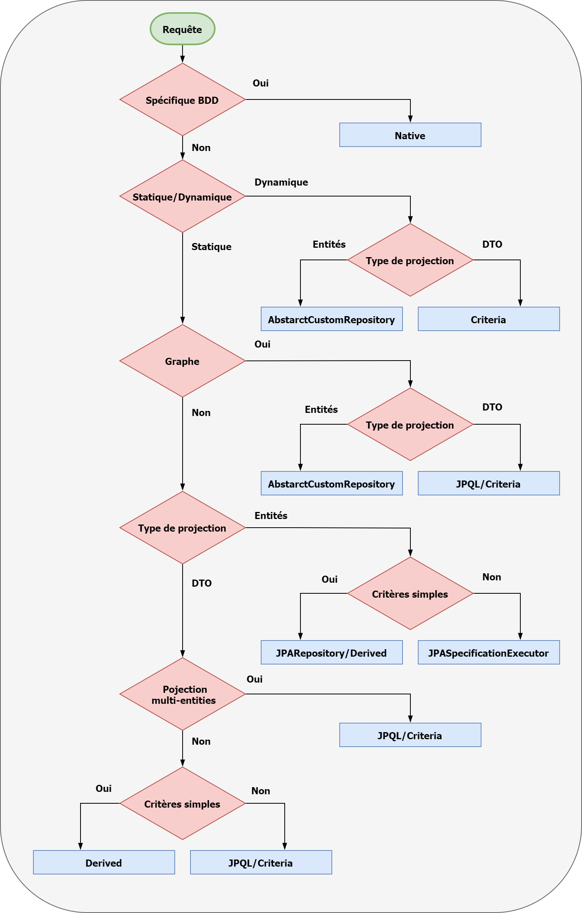

# Synopsis
La Java Persistence API (abrégée en JPA), est une interface de programmation Java permettant aux développeurs d'organiser des données relationnelles dans des applications utilisant la plateforme Java.
La Java Persistence API repose essentiellement sur l'utilisation des annotations, introduites dans Java 5. Elles permettent de définir facilement des objets métier, qui pourront servir d'interface entre la base de données et l'application, dans le cadre d'un mapping objet-relationnel. 
Il est possible de faire du requêtage par plusieurs méthodes.  
  
Ce tutoriel a pour but de présenter des méthodes (non exhaustif) en précisant leurs cas d'utilisations, les avantages et inconvénients.
Ce tutoriel utilise Spring Data JPA qui falicite le développement d'applications JPA. L'implémentation de JPA choisie est hibernate.
Le tutoriel se focalise uniquement sur les requêtes de sélection.  
  
Le premier chapitre aborde des notions essentielles pour comprendre JPA (graphe, projection, statique/dynamique, problèmes) permettant de définir le concept de requête efficace.
Les chapitres suivants montrent l'implémentation nécéssaire (entités, repository, méthodes de requêtage) d'un projet d'exemple. 
Le chapitre tests unitaires montre l'implémentation des appels et sert aussi à vérifier la conformité par rapport au concept de requête efficace. 
Dans la conclusion se trouve un arbre de décision servant à choisir la meilleure méthode selon le cas d'utilisation. 

# Notions
On se focalise sur les notions suivantes pour faire le choix de la méthode :

- Simplicité à implémenter et réutilisabilité
- Graphe
- Projection
- Statique ou dynamique
- Problèmes JPA

Ces notions (hormis la première qui est basique)  sont présentées par la suite.    
Tout ceci permet d'arriver à formuler le concept de requête efficace.  

## Graphe
En JPA la requête va manipuler une entitée de départ (root) et éventuellement des entités en jointures.  
Si seul l'entité root est à retourner alors il n'y a pas de graphe.  
Attention seule la partie à retourner est à prendre en compte, si des jointures sont nécéssaires uniquement pour la clause `where` cela n'entraine pas un graphe.  

## Projection
En JPA il existe plusieurs types de projection :

- Scalar : retourne un résultat non typé
- DTO : retourne un résultat typé contenant certains champs d'une entité (ou de plusieurs si graphe)
- Entités : retourne un résultat de type entité

L'utilisation de la projection scalar est à éviter car on peut tout faire avec les autres et elles sont plus faciles d'utilisation.

### Projection DTO
La projection DTO a pour principal avantage de ne pas avoir à récupérer tous les champs de la table. 
Elle nécessite de créer un Objet (le DTO) qui correspond au résultat de la requête. 
Elle est à utiliser dans le cas read only uniquement (difficile d'appeler un save sur l'entité par la suite). 
Elle est plus performante que la projection entités surtout dans le cas où le nombre de lignes retournées est très grand ou encore dans le cas où il y a des champs de type LOB à ne pas retourner.  
Elle évite les problèmes de `LazyInitializationException` et de `N + 1` (abordés par la suite). 
Elle nécéssite s'il y a graphe un autre Objet et un mapper voir exemple ci-après.

_Exemple :_  
Récupérer une liste de personnes avec sa liste d'adresses mails provenant de la table personne en lien (1,N) avec la table adresse. 
L'objet à retourner doit être de la forme `Objet(long id,String nom, List<String> libelleList)`. 
Seul les champs identifiant et nom de la personne, libellé de l'adresse sont obligatoires. 
Dans ce cas on crée un premier objet DTO de type `Objet(long id,String nom, String libelle)` correspondant directement à une ligne de résultats. 
Ensuite on crée l'objet correpondant à la demande et enfin on crée un mapper pour transformer la liste d'objets résultats en liste d'objets de la demande. 
La projection DTO peut donc coûter cher en termes d'implémentation et de maintenance.

DTO est un terme générique et il se trouve qu'on l'utilise aussi dans la couche controller dans le cas de REST, pour cette raison les DTO correspondant à un résultat de requêtes sont suffixés non pas par DTO mais par Result. 
De cette manière dans un projet REST + JPA il n'y a pas de confusion possible entre les objets utilisés dans les deux couches.  

### Projection entités
C'est la projection la plus commune et la plus simple à utiliser. 
Elle est parfaite dans le cas où on va ensuite appeler une requête de modification. 
Elle est moins performante que la projection DTO mais selon le cas c'est négligeable. 
Elle ne nécessite pas d'implémenter un mapper.

## Statique/Dynamique
Selon le type utilisé il y a un gain en termes de temps (négligeable) et de détection d'erreur de syntaxe.  

### Requêtes statiques
Les requêtes statiques sont invariables au niveau structure, elles ne dépendent pas d'une entrée utilisateur. 
Elles sont générées (transformation en SQL) au lancement de l'application et mise en cache. 
A chaque appel de la requête, on gagne donc le temps de génération. 
Autre avantage si la génération échoue (erreur de syntaxe), le démarrage est immédiatement stoppé, on sait donc tout de suite qu'il y a une erreur.

### Requêtes dynamique
Les requêtes dynamiques changent de structure selon les entrées utilisateur. 
A chaque appel, la requête est générée à nouveau. 
S’il y a une erreur, on le voit uniquement à l'appel. 
Les requêtes dynamiques correspondent par exemple au cas d'un formulaire multi-critères car dans ce cas, impossible de connaître la structure à l'avance.  

Utiliser une requête dynamique à la place d'une statique n'est pas problématique. 
Sur l'aspect génération, le gain de temps est négligeable par rapport au temps d'exécution global (génération + requête + mapping) et sur l'aspect détection de l'erreur de syntaxe les tests sont là pour ça. 
L'aspect implémentation et réutilisabilité est plus important.

## Problèmes JPA

### LazyInitializationException et N + 1

Ces deux problèmes interviennent dans la phase de manipulation du résultat et pour une même cause, l'appel d'une méthode sur une entité en jointure sans que le graphe ne soit chargé. 
Si aucune connection avec la base n'est ouverte alors `LazyInitializationException` sinon `N + 1`. 
Ci-dessous un extrait de l'entité `Contrat` et le service `ContratService`. `ContratService` n'est là que pour montrer un exmple des deux problèmes. 
Les deux méthodes ont le même code, toute la subtilité réside dans l'annotation `@Transactional` qui garde une connection ouverte, ce qui va produire un `N + 1` à la place d'une `LazyInitializationException`.

```java
@Entity
@Table(name = "contrat")
public class Contrat {
    // ...

    @ManyToOne(fetch = FetchType.LAZY)
    private Societe societe;
   
    // ...
}
```

```java
/**
 * Classe de service du Contrat
 */
@Service
@RequiredArgsConstructor
@Slf4j
@SuppressWarnings("squid:S4144")
public class ContratService {

    private final ContratRepository contratRepository;

    @Transactional(readOnly = true)
    public void showNPlusOneProblem() {
        List<Contrat> contratList = contratRepository.findAll();
        contratList.forEach(this::printAdressMail);
    }

    public void showLazyInitializationException() {
        List<Contrat> contratList = contratRepository.findAll();
        contratList.forEach(this::printAdressMail);
    }

    private void printAdressMail(Contrat contrat) {
        contrat.getSociete().getAvocat().getAdresseMailSet().forEach(
                adresseMail -> log.info(adresseMail.toString())
        );
    }

}
```
On peut croire que le problème `LazyInitializationException` est plus grave, car il est bloquant mais en fait non car on le voit et on corrige. 
Le problème `N + 1` est plus sournois, il est plus difficile à détecter car non bloquant. Si le jeu de données de tests est petit et que l'on n'a pas
activé l'affichage des requêtes, on ne va pas le voir. Une fois en production avec des données plus volumineuses, c'est la catastrophe assurée en termes de performance. 
N peut devenir énorme surout si comme dans cet exemple, on enchaine plusieurs entités.

### Détection
Il faut afficher les requêtes générées en développement et en test.

```yaml
# SPRING
spring:
  #JPA
  jpa:
    show-sql: true
```

### Résolution
Dans les deux cas, il faut soit changer le graphe de la requête, soit la réécrire en projection DTO. 
Il ne faut pas mettre toutes les entités en jointure en `fetch = FetchType.EAGER`. Mettre tout en `EAGER`, signifie qu'on va faire systématiquement la jointure donc ça va entraîner des problèmes de performance. 
Il ne faut pas non plus passer d'un `LazyInitializationException` à un `N + 1` en ajoutant `@Transactional`.

## Concept de requête efficace
A partir des notions, on peut en déduire ce qu'est une requête efficace :

- Pas de `N + 1` ou de `LazyInitializationException` à l'utilisation du résultat
- Chargement du graphe demandé et pas de jointure supplémentaire qui dégrade la performance
- Projection entités à part si gain de performance important avec la projection DTO en accord avec la notion de simplicité/réutilisabilité

# Entités

Ce paragraphe peut être à lui seul une documentation complète, on évoque seulement le minimal et notemment la partie en lien avec la génération de requête. 
Générer en automatique depuis la base donne une base de travail (cas du database first).

**CheckList :**  

- Annotation JPA
    - Pour la classe
	
	```java
	@Entity
	@Table(name = "table_nom")
	```
	  
    - Pour la clé primaire
	
    ```java
    @Id
    @Column(name = "colonne_nom", unique = true, nullable = false)
    ```
	  
    - Pour les clés étrangères
	
    ```java
    // de base on force tout à LAZY il faut le préciser car par défaut ManyToOne et OneToOne sont en EAGER
    @OneToOne(fetch = FetchType.LAZY) 
    @ManyToOne(fetch = FetchType.LAZY)
    @OneToMany(fetch = FetchType.LAZY, mappedBy = "...")
    @ManyToMany(fetch = FetchType.LAZY, mappedBy = "...")
    ```
	
    - Pour les autres champs
	
    ```java
    @Basic
    @Column(name = "colonne_nom")
    ```
	  
- Annotation lombok sur la classe

```java
@Getter
@Setter
// dans le @ToString on exclus tous les attributs LAZY
@ToString(exclude = {"attributLAZY_1", "attributLAZY_2", ...,"attributLAZY_N"})
```

Si besoin d'un tutoriel lombok c'est [ici](https://fxrobin.developpez.com/tutoriels/java/lombok-retour-experience/  "tuto lombok") , sinon générer via l'IDE les getter/setter et le toString (sans les attributs en LAZY).  

_Astuce_ :  
Si votre générateur met les annotations JPA sur les getter il faut lui renseigner un orm.xml pour lui préciser "access FIELD".    

```xml
<?xml version="1.0" encoding="UTF-8"?>
<entity-mappings xmlns="http://xmlns.jcp.org/xml/ns/persistence/orm"
  xmlns:xsi="http://www.w3.org/2001/XMLSchema-instance"
  xsi:schemaLocation="http://xmlns.jcp.org/xml/ns/persistence/orm
    http://xmlns.jcp.org/xml/ns/persistence/persistence_2_2.xsd"
  version="2.2">
  <persistence-unit-metadata>
    <persistence-unit-defaults>
      <access>FIELD</access>
    </persistence-unit-defaults>
  </persistence-unit-metadata>
</entity-mappings>
```

Afin d'accéder aux attributs des entités, on utilise hibernate-jpamodelgen.

```xml
<!-- hibernate jpamodelgen -->
<dependency>
  <groupId>org.hibernate</groupId>
  <artifactId>hibernate-jpamodelgen</artifactId>
</dependency>
```

## Modèle de données et graphe
Pour présenter les différentes méthodes de requêtages on utilise le MPD suivant :

 

Ce modèle correspond à un projet de gestion de contrat :

- Un contrat à une liste de statuts et une liste de versions
- Un contrat à une société qui elle peut avoir plusieurs contrats
- Une societé à deux personnes (président, avocat)
- Une personne à une liste d'adresses mails

Ce MPD donne l'implémentation suivante :

```java
@Entity
@Table(name = "contrat")
@Getter
@Setter
@ToString(exclude = {"societe", "contratStatutSet", "contratVersionSet"})
public class Contrat {

    @Id
    @Column(name = "id", nullable = false)
    private long id;
    @Basic
    @Column(name = "nom", nullable = false, length = 50)
    private String nom;

    // FK FIELD
    @ManyToOne(fetch = FetchType.LAZY)
    @JoinColumn(name = "fk_societe_id", nullable = false)
    private Societe societe;

    // JPA FIELD
    @OneToMany(fetch = FetchType.LAZY, mappedBy = "contrat")
    private Set<ContratStatut> contratStatutSet;
    @OneToMany(fetch = FetchType.LAZY, mappedBy = "contrat")
    private Set<ContratVersion> contratVersionSet;
```

```java
@Entity
@Table(name = "contrat_statut")
@Getter
@Setter
@ToString(exclude = {"contrat"})
public class ContratStatut {

    @Id
    @Column(name = "id", nullable = false)
    private long id;
    @Basic
    @Column(name = "statut", nullable = false, length = 50)
    private String statut;
    @Basic
    @Column(name = "actif", nullable = false)
    private boolean actif;

    // FK FIELD
    @ManyToOne(fetch = FetchType.LAZY)
    @JoinColumn(name = "fk_contrat_id", nullable = false)
    private Contrat contrat;
}
```

```java
@Entity
@Table(name = "contrat_version")
@Getter
@Setter
@ToString(exclude = {"contrat"})
public class ContratVersion {

    @Id
    @Column(name = "id", nullable = false)
    private long id;
    @Basic
    @Column(name = "nom", nullable = false, length = 50)
    private String nom;
    @Basic
    @Column(name = "numero_version", nullable = false)
    private int numeroVersion;
    @Basic
    @Column(name = "actif", nullable = false)
    private boolean actif;

    // FK FIELD
    @ManyToOne(fetch = FetchType.LAZY)
    @JoinColumn(name = "fk_contrat_id", nullable = false)
    private Contrat contrat;
}
```

```java
@Entity
@Table(name = "societe")
@Getter
@Setter
@ToString(exclude = {"contratSet", "avocat", "president"})
public class Societe {

    @Id
    @Column(name = "id", nullable = false)
    private long id;
    @Basic
    @Column(name = "nom", nullable = false, length = 50)
    private String nom;
    @Basic
    @Column(name = "numero", nullable = false, length = 5)
    private String numero;

   // FK FIELD
    @ManyToOne(fetch = FetchType.LAZY)
    @JoinColumn(name = "fk_personne_avocat_id", nullable = false)
    private Personne avocat;
    @ManyToOne(fetch = FetchType.LAZY)
    @JoinColumn(name = "fk_personne_president_id", nullable = false)
    private Personne president;

    // JPA FIELD
    @OneToMany(fetch = FetchType.LAZY, mappedBy = "societe")
    private Set<Contrat> contratSet;
}
```

```java
@Entity
@Table(name = "personne")
@Getter
@Setter
@ToString(exclude = {"adresseMailSet"})
public class Personne {

    @Id
    @Column(name = "id", nullable = false)
    private long id;
    @Basic
    @Column(name = "nom", nullable = false, length = 50)
    private String nom;
    @Basic
    @Column(name = "prenom", nullable = false, length = 50)
    private String prenom;
    @Basic
    @Column(name = "avocat", nullable = false)
    private boolean avocat;
    @Basic
    @Column(name = "president", nullable = false)
    private boolean president;

    // JPA FIELD
    @OneToMany(fetch = FetchType.LAZY, mappedBy = "personne")
    private Set<AdresseMail> adresseMailSet;
}
```

```java
@Entity
@Table(name = "adresse_mail")
@Getter
@Setter
@ToString(exclude = {"personne"})
public class AdresseMail {

    @Id
    @Column(name = "id", nullable = false)
    private long id;
    @Basic
    @Column(name = "libelle", nullable = false, length = 50)
    private String libelle;

    // FK FIELD
    @ManyToOne(fetch = FetchType.LAZY)
    @JoinColumn(name = "fk_personne_id", nullable = false)
    private Personne personne;
}
```

Au niveau graphe cela donne le schéma suivant : 

 

En pointillé se trouve les trois sous graphes qui donne le graphe complet à récupérer. 
Ce graphe est utilisé par la suite pour différentes méthodes de requêtage.

# Repository
L'implémentation se base sur les fragments (recommandation spring data JPA). 
L'interface de repository qui étend tous les fragments est une composition de repository. 
L'interface de repository a accès à toutes les méthodes des fragments. 
L'interface de repository peut déclarer des méthodes supplémentaires. 
Une méthode déclarée dans cette interface est non custom, elle ne nécessite pas d'implémentation.

```java
/**
 * Interface pour les methodes non custom du repository Contrat
 */
@Repository
public interface ContratRepository extends JpaRepository<Contrat, Long>, JpaSpecificationExecutor<Contrat>,
 ContratCustomRepository {
   // Décalartion des méthodes non custom
}
```

`JpaRepository` étend `QueryByExampleExecutor` et `PagingAndSortingRepository` qui étend `CrudRepository`. 
Avec cette implémentation, il y a déjà un bon nombre de méthodes à disposition ne nécessitant aucune implémentation. 
Les autres méthodes qui sont custom car elles nécessitent une implémentation sont dans l'interface `ContratCustomRepository`.

```java
/**
 * Interface pour les methodes custom du repository Contrat
 */
public interface ContratCustomRepository {
    // Décalartion des méthodes custom
}
```

Une classe abstraite générique contenant deux autres méthodes est à disposition pour les repository custom.

```java
/**
 * Classe generique pour les methodes custom de repository
 */
@Slf4j
public abstract class AbstractCustomRepository<T> {
    
    /**
     * Permet de recuperer une liste d entites en choisissant le graphe et la specification
     *
     * @param subGraphUtilList
     * @param specification
     * @return une liste d entites en choisissant le graphe
     */
    public List<T> findAllWithGraphAndSpecification(List<SubGraphUtil> subGraphUtilList,
                                                    @Nullable Specification<T> specification) {
            // ...
    }

    /**
     * Permet de recuperer une entite en choisissant le graphe et la specification
     *
     * @param subGraphUtilList
     * @param specification
     * @return une entite en choisissant le graphe
     */
    public Optional<T> findOneWithGraphAndSpecification(List<SubGraphUtil> subGraphUtilList, 
                                                        @Nullable Specification<T> specification) {
        //...
    }
}
```

`SubGraphUtil` est une classe utilitaire servant à créer les graphes.

```java
/**
 * Classe utilitaire pour creer les graphes
 */
@Getter
@Setter
public final class SubGraphUtil {

    private String name;
    private List<SubGraphUtil> subGraphUtilList;

    public SubGraphUtil(String name) {
        this.name = name;
    }
}
```

La classe d'implémentation du repository custom étend la classe abstraite générique pour bénéficier des méthodes.  

```java
/**
 * Classe d implementation des methodes custom du repository contrat
 */
@SuppressWarnings({"unused","squid:S1192"})
public class ContratCustomRepositoryImpl extends AbstractCustomRepository<Contrat> 
        implements ContratCustomRepository {   
    // Implémentation des méthodes custom
}
```

La structure complète est en place.

# Méthodes de requêtage
Pour les méthodes ne pouvant réaliser que des choses simples, on précise le type de demande possible.  
Pour les méthodes pouvant réaliser des choses complexes et afin de les comparer, on utilise quatre demandes : 

- Graphe, projection entités
- Graphe, projection entités, clause `where` statique
- Graphe, projection DTO, clause `where` statique
- Graphe, projection entités, clause `where` dynamique


Le graphe commun est celui du paragraphe Modèle de données et graphe.  
La clause `where` est un `AND` entre trois critères :

- `In` sur l'identifiant contrat
- `Equal` sur le booléen actif de contratVersion
- `EndWithIgnoreCase` sur le libellé de l'adresse mail de l'avocat

L'objet commun `ContratCriteria` pour clause `where` dynamique comporte les trois mêmes attributs que ceux de la clause `where` statique : 

```java
@Data
@Builder
public class ContratCriteria {

    // contrat
    private List<Long> contratIdList;
    // contratVersion
    private Boolean contratVersionActif;
    // societe
    // adresseMail
    private String suffixAvocatMail;
}
```

L'objet commun `ContratProjectionResult` pour la projection DTO :

```java
@Value
public class ContratProjectionResult {

    // contrat
    long contratId;
    String contratNom;
    // contratVersion
    long contratVersionId;
    int contratVersionNumero;
    // societe
    long societeId;
    String societeNom;
    // personne
    String avocatNom;
    String presidentNom;
    // adresseMail
    String avocatMail;
}
```

Pour toutes les méthodes des exemples sont présents dans le paragraphe Tests unitaires.

## CrudRepository query

**Type de demande :**

- Récupérer le contrat avec tous ses champs par son identifiant
- Récupérer les contrats avec tous leurs champs


**Avantages :**

- Aucune implémentation
  
**Inconvénients :**

- Statique
- Sans graphe
- Projection entités sur la root uniquement
- Sans projection DTO

## Derived query

**Type de demande :**

- Récupérer les contrats avec tous leurs champs par l'identifiant société
- Récupérer les contrats avec tous leurs champs dont le nom de la société commence par
- Récupérer les contrats avec les champs id,nom par l'identifiant société
- Récupérer les contrats avec le champ id par l'identifiant société

**Avantages :**

- Pas d'implémentation, juste une déclaration (à part les DTO si projection DTO)
- Projection DTO dynamique
  
**Inconvénients :**

- Statique
- Sans graphe
- Projection entités sur la root uniquement
- Projection DTO sur la root uniquement (sinon génère du `N + 1`)

Les demandes 3 et 4 sont traitées par une même méthode gérant la projection DTO dynamique.  

**Implémentation :**  
Déclaration dans `ContratRepository` car non custom.

```java
List<Contrat> findBySocieteId(long societeId);

List<Contrat> findBySocieteNomStartsWith(String prefixSociete);

<T> List<T> findBySocieteId(long societeId, Class<T> type);
```

Création des Classes correspondantes aux projections DTO. Spring data JPA propose l'utilisation de l'annotaion @Value de lombok. 
A partir de JAVA 14 on peut utiliser un record.

```java
@Value
public class ContratIdNameResult {

    long id;
    String nom;
}
```

```java
@Value
public class IdResult {

    long id;
}
```

## Example query

**Type de demande :**

- Récupérer les contrats selon le contrat en exemple

**Avantages :**

- Aucune implémentation
- Dynamique
- Nombreux matcher existant
  
**Inconvénients :**

- Sans graphe
- Projection entités sur la root uniquement
- Sans projection DTO  

## JPQL query

**Avantages :**

- Graphe
- Projection entités et DTO

**Inconvénients :**

- Dynamique possible mais à proscrire (illisible, inmaintenable)
- Implémentation non réutilisable

**Implémentation :**  
Déclaration dans `ContratCustomRepository` car custom.

```java
List<Contrat> findJPQLGraph();

List<Contrat> findJPQLGraphWhere(List<Long> contratIdList, boolean contratVersionActif,
                                 String suffixMail);

List<ContratProjectionResult> findJPQLGraphWhereProjection(List<Long> contratIdList,
                                                           boolean contratVersionActif,
                                                           String suffixMail);
```

Implémentation dans `ContratCustomRepositoryImpl`

```java
@Override
public List<Contrat> findJPQLGraph() {
    TypedQuery<Contrat> typedQuery = entityManager.createQuery("SELECT DISTINCT c FROM Contrat c "
                    + "JOIN FETCH c.contratVersionSet cv "
                    + "JOIN FETCH c.societe s "
                    + "JOIN FETCH s.avocat a "
                    + "JOIN FETCH a.adresseMailSet am "
                    + "JOIN FETCH s.president p ",
            Contrat.class
    );
    return typedQuery.getResultList();
}

@Override
public List<Contrat> findJPQLGraphWhere(List<Long> contratIdList, boolean contratVersionActif,
                                        String suffixMail) {
    TypedQuery<Contrat> typedQuery = entityManager.createQuery("SELECT DISTINCT c FROM Contrat c "
                    + "JOIN FETCH c.contratVersionSet cv "
                    + "JOIN FETCH c.societe s "
                    + "JOIN FETCH s.avocat a "
                    + "JOIN FETCH a.adresseMailSet am "
                    + "JOIN FETCH s.president p "
                    + "WHERE c.id IN (:contratIdList) "
                    + "AND cv.actif = :contratVersionActif "
                    + "AND UPPER(am.libelle)  LIKE :suffixMail ",
            Contrat.class
    );
    typedQuery.setParameter("contratIdList", contratIdList);
    typedQuery.setParameter("contratVersionActif", contratVersionActif);
    typedQuery.setParameter("suffixMail", "%" + suffixMail.toUpperCase());
    return typedQuery.getResultList();
}

@Override
public List<ContratProjectionResult> findJPQLGraphWhereProjection(List<Long> contratIdList,
                                                                  boolean contratVersionActif,
                                                                  String suffixMail) {
    TypedQuery<ContratProjectionResult> typedQuery = entityManager.createQuery("SELECT NEW fr.agoero" +
                    ".result" +
                    ".ContratProjectionResult("
                    + "c.id,"
                    + "c.nom,"
                    + "cv.id,"
                    + "cv.numeroVersion,"
                    + "s.id,"
                    + "s.nom,"
                    + "a.nom,"
                    + "p.nom,"
                    + "am.libelle)"
                    + "FROM Contrat c "
                    + "JOIN  c.contratVersionSet cv "
                    + "JOIN  c.societe s "
                    + "JOIN  s.avocat a "
                    + "JOIN  a.adresseMailSet am "
                    + "JOIN  s.president p "
                    + "WHERE c.id IN (:contratIdList) "
                    + "AND cv.actif = :contratVersionActif "
                    + "AND UPPER(am.libelle)  LIKE :suffixMail ",
            ContratProjectionResult.class
    );
    typedQuery.setParameter("contratIdList", contratIdList);
    typedQuery.setParameter("contratVersionActif", contratVersionActif);
    typedQuery.setParameter("suffixMail", "%" + suffixMail.toUpperCase());
    return typedQuery.getResultList();
}
```

Une autre implémentation moins verbeuse est possible en utilisant `@Query`.

```java
 /**
  * Interface pour les methodes non custom du repository Contrat
  */
 @Repository
 public interface ContratRepository extends JpaRepository<Contrat, Long>, JpaSpecificationExecutor<Contrat>,
         ContratCustomRepository {
 
         @Query("SELECT DISTINCT c FROM Contrat c "
             + "JOIN FETCH c.contratVersionSet cv "
             + "JOIN FETCH c.societe s "
             + "JOIN FETCH s.avocat a "
             + "JOIN FETCH a.adresseMailSet am "
             + "JOIN FETCH s.president p ")
         List<Contrat> findJPQLGraph();
 }
```

Avec cette annotation plus besoin d'implémentation dans `ContratCustomRepositoryImpl` mais inconvénients :

- Non respect des fragments car obligation de déclarer sur l'interface non custom
- Plus de point d'arrêt possible
- Aucun ajout de code possible

## Criteria query

**Avantages :**

- Graphe
- Projection entités et DTO
- Dynamique

**Inconvénients :**

- Implémentation non réutilisable
- Implémentation verbeuse

**Implémentation :**  
Déclaration dans `ContratCustomRepository` car custom.

```java
List<Contrat> findCriteriaGraph();

List<Contrat> findCriteriaGraphWhere(List<Long> contratIdList, boolean contratVersionActif,
                                     String suffixMail);

List<ContratProjectionResult> findCriteriaGraphWhereProjection(List<Long> contratIdList,
                                                               boolean contratVersionActif,
                                                               String suffixMail);

List<Contrat> findCriteriaGraphWhereDynamic(ContratCriteria contratCriteria);
```

Implémentation dans `ContratCustomRepositoryImpl`

```java
@Override
public List<Contrat> findCriteriaGraph() {
    CriteriaBuilder criteriaBuilder = entityManager.getCriteriaBuilder();
    CriteriaQuery<Contrat> criteriaQuery = criteriaBuilder.createQuery(Contrat.class);
    Root<Contrat> contratRoot = criteriaQuery.from(Contrat.class);
    contratRoot.fetch(Contrat_.CONTRAT_VERSION_SET);
    Fetch<Contrat, Societe> societeFetch = contratRoot.fetch(Contrat_.SOCIETE);
    Fetch<Societe, Personne> avocatFetch = societeFetch.fetch(Societe_.AVOCAT);
    avocatFetch.fetch(Personne_.ADRESSE_MAIL_SET);
    societeFetch.fetch(Societe_.PRESIDENT);
    criteriaQuery.distinct(true);
    return entityManager.createQuery(criteriaQuery).getResultList();
}

@Override
@SuppressWarnings("unchecked")
public List<Contrat> findCriteriaGraphWhere(List<Long> contratIdList, boolean contratVersionActif,
                                            String suffixMail) {
    CriteriaBuilder criteriaBuilder = entityManager.getCriteriaBuilder();
    CriteriaQuery<Contrat> criteriaQuery = criteriaBuilder.createQuery(Contrat.class);
    criteriaQuery.distinct(true);
    Root<Contrat> contratRoot = criteriaQuery.from(Contrat.class);
    Fetch<Contrat, ContratVersion> contratVersionFetch = contratRoot.fetch(Contrat_.CONTRAT_VERSION_SET);
    Join<Contrat, ContratVersion> contratVersionJoin =
            (Join<Contrat, ContratVersion>) contratVersionFetch;
    Fetch<Contrat, Societe> societeFetch = contratRoot.fetch(Contrat_.SOCIETE);
    Fetch<Societe, Personne> avocatFetch = societeFetch.fetch(Societe_.AVOCAT);
    Fetch<Personne, AdresseMail> adresseMailFetch = avocatFetch.fetch(Personne_.ADRESSE_MAIL_SET);
    Join<Personne, AdresseMail> adresseMailJoin = (Join<Personne, AdresseMail>) adresseMailFetch;
    societeFetch.fetch(Societe_.PRESIDENT);
    // predicate
    Predicate contratIdIn = contratRoot.get(Contrat_.ID).in(contratIdList);
    Predicate contratVersionActifEqual =
            criteriaBuilder.equal(contratVersionJoin.get(ContratVersion_.ACTIF),
                    contratVersionActif);
    Predicate adresseMailEndWithIgnoreCase =
            criteriaBuilder.like(criteriaBuilder.upper(adresseMailJoin.get(AdresseMail_.LIBELLE)),
                    "%" + suffixMail.toUpperCase());
    criteriaQuery.where(criteriaBuilder.and(contratIdIn, contratVersionActifEqual,
            adresseMailEndWithIgnoreCase));
    return entityManager.createQuery(criteriaQuery).getResultList();
}

@Override
public List<ContratProjectionResult> findCriteriaGraphWhereProjection(List<Long> contratIdList,
                                                                      boolean contratVersionActif,
                                                                      String suffixMail) {
    CriteriaBuilder criteriaBuilder = entityManager.getCriteriaBuilder();
    CriteriaQuery<ContratProjectionResult> criteriaQuery =
            criteriaBuilder.createQuery(ContratProjectionResult.class);
    Root<Contrat> contratRoot = criteriaQuery.from(Contrat.class);
    Join<Contrat, ContratVersion> contratVersionJoin = contratRoot.join(Contrat_.CONTRAT_VERSION_SET);
    Join<Contrat, Societe> societeJoin = contratRoot.join(Contrat_.SOCIETE);
    Join<Societe, Personne> avocatJoin = societeJoin.join(Societe_.AVOCAT);
    Join<Personne, AdresseMail> adresseMailJoin = avocatJoin.join(Personne_.ADRESSE_MAIL_SET);
    Join<Societe, Personne> presidentJoin = societeJoin.join(Societe_.PRESIDENT);
    criteriaQuery.select(criteriaBuilder.construct(ContratProjectionResult.class,
            contratRoot.get(Contrat_.ID),
            contratRoot.get(Contrat_.NOM),
            contratVersionJoin.get(ContratVersion_.ID),
            contratVersionJoin.get(ContratVersion_.NUMERO_VERSION),
            societeJoin.get(Societe_.ID),
            societeJoin.get(Societe_.NOM),
            avocatJoin.get(Personne_.NOM),
            presidentJoin.get(Personne_.NOM),
            adresseMailJoin.get(AdresseMail_.LIBELLE)
            )
    );
    // predicate
    Predicate contratIdIn = contratRoot.get(Contrat_.ID).in(contratIdList);
    Predicate contratVersionActifEqual =
            criteriaBuilder.equal(contratVersionJoin.get(ContratVersion_.ACTIF),
                    contratVersionActif);
    Predicate adresseMailEndWithIgnoreCase =
            criteriaBuilder.like(criteriaBuilder.upper(adresseMailJoin.get(AdresseMail_.LIBELLE)),
                    "%" + suffixMail.toUpperCase());

    criteriaQuery.where(criteriaBuilder.and(contratIdIn, contratVersionActifEqual,
            adresseMailEndWithIgnoreCase));
    return entityManager.createQuery(criteriaQuery).getResultList();
}

@SuppressWarnings("unchecked")
@Override
public List<Contrat> findCriteriaGraphWhereDynamic(ContratCriteria contratCriteria) {
    List<Predicate> predicateList = new ArrayList<>();
    CriteriaBuilder criteriaBuilder = entityManager.getCriteriaBuilder();
    CriteriaQuery<Contrat> criteriaQuery = criteriaBuilder.createQuery(Contrat.class);
    criteriaQuery.distinct(true);
    Root<Contrat> contratRoot = criteriaQuery.from(Contrat.class);
    Fetch<Contrat, ContratVersion> contratVersionFetch = contratRoot.fetch(Contrat_.CONTRAT_VERSION_SET);
    Fetch<Contrat, Societe> societeFetch = contratRoot.fetch(Contrat_.SOCIETE);
    Fetch<Societe, Personne> avocatFetch = societeFetch.fetch(Societe_.AVOCAT);
    Fetch<Personne, AdresseMail> adresseMailFetch = avocatFetch.fetch(Personne_.ADRESSE_MAIL_SET);
    societeFetch.fetch(Societe_.PRESIDENT);
    // predicate
    if (isNotEmpty(contratCriteria.getContratIdList())) {
        Predicate contratIdIn = contratRoot.get(Contrat_.ID).in(contratCriteria.getContratIdList());
        predicateList.add(contratIdIn);
    }
    if (contratCriteria.getContratVersionActif() != null) {
        Join<Contrat, ContratVersion> contratVersionJoin =
                (Join<Contrat, ContratVersion>) contratVersionFetch;
        Predicate contratVersionActifEqual =
                criteriaBuilder.equal(contratVersionJoin.get(ContratVersion_.ACTIF),
                        contratCriteria.getContratVersionActif());
        predicateList.add(contratVersionActifEqual);
    }
    if (isNotBlank(contratCriteria.getSuffixAvocatMail())) {
        Join<Personne, AdresseMail> adresseMailJoin = (Join<Personne, AdresseMail>) adresseMailFetch;
        Predicate adresseMailEndWithIgnoreCase =
                criteriaBuilder.like(criteriaBuilder.upper(adresseMailJoin.get(AdresseMail_.LIBELLE)),
                        "%" + contratCriteria.getSuffixAvocatMail().toUpperCase());
        predicateList.add(adresseMailEndWithIgnoreCase);
    }
    criteriaQuery.where(predicateList.toArray(new Predicate[]{}));
    return entityManager.createQuery(criteriaQuery).getResultList();
}
```

## Native query
A éviter à part dans le cas où la requête comporte quelque chose de spécifique à la base de données. 
Un seul cas pour faire comprendre à quel point c'est plus verbeux.

**Implémentation :**  
Déclaration dans `ContratCustomRepository` car custom.

```java
List<ContratProjectionResult> findNativeGraphWhereProjection(List<Long> contratIdList,
                                                             boolean contratVersionActif,
                                                             String suffixMail);
```

Implémentation dans `ContratCustomRepositoryImpl`

```java
@Override
@SuppressWarnings("unchecked")
public List<ContratProjectionResult> findNativeGraphWhereProjection(List<Long> contratIdList,
                                                                    boolean contratVersionActif,
                                                                    String suffixMail) {
    Query query = entityManager.createNativeQuery("SELECT "
                    + "c.id AS contratId, "
                    + "c.nom AS contratNom, "
                    + "cv.id AS contratVersionId, "
                    + "cv.numero_version AS contratVersionNumero, "
                    + "s.id AS societeId, "
                    + "s.nom AS societeNom, "
                    + "a.nom AS avocatNom, "
                    + "p.nom AS presidentNom, "
                    + "am.libelle AS avocatMail "
                    // from
                    + "FROM contrat c "
                    + "JOIN contrat_version cv ON c.id = cv.fk_contrat_id "
                    + "JOIN societe s ON c.fk_societe_id = s.id  "
                    + "JOIN personne p ON s.fk_personne_president_id = p.id "
                    + "JOIN personne a ON s.fk_personne_avocat_id = a.id "
                    + "JOIN adresse_mail am ON a.id = am.fk_personne_id "
                    // where
                    + "WHERE c.id IN (:contratIdList) "
                    + "AND cv.actif = :contratVersionActif "
                    + "AND UPPER(am.libelle)  LIKE :suffixMail",
            "ContratProjectionMapping");
    query.setParameter("contratIdList", contratIdList);
    query.setParameter("contratVersionActif", contratVersionActif);
    query.setParameter("suffixMail", "%" + suffixMail.toUpperCase());
    return query.getResultList();
}
```

Ici l'implémentation doit ajouter du code pour le mapping car il n'y a pas d'équivalent au `criteriaBuilder.construct` ni au `SELECT NEW`.  
On déclare un mapping via la classe `ContratProjectionMapping` :

```java
@MappedSuperclass
@SqlResultSetMapping(
        name = "ContratProjectionMapping",
        classes = @ConstructorResult(
                targetClass = ContratProjectionResult.class,
                columns = {
                        @ColumnResult(name = "contratId", type = Long.class),
                        @ColumnResult(name = "contratNom", type = String.class),
                        @ColumnResult(name = "contratVersionId", type = Long.class),
                        @ColumnResult(name = "contratVersionNumero", type = Integer.class),
                        @ColumnResult(name = "societeId", type = Long.class),
                        @ColumnResult(name = "societeNom", type = String.class),
                        @ColumnResult(name = "avocatNom", type = String.class),
                        @ColumnResult(name = "presidentNom", type = String.class),
                        @ColumnResult(name = "avocatMail", type = String.class)
                }
        )
)
public class ContratProjectionMapping {

}
```

Il est possible de déclarer le `@SqlResultSetMapping` directement sur l'entité mais c'est de la "pollution d'entité". 
S’il y a trois Native query avec trois mappings différents l'entité est illisible.  
_Astuce :_  
Certains propose d'utiliser comme ici une classe à part mais utilise un @Entity ce qui apporte un lot d'inconvénients :

- Déclaration obligatoire d'un champ identifiant avec son annotation @Id
- Pose des problèmes au démarrage de l'application à cause du ddl-auto

Si le `ddl-auto` est en `validate`, l'application ne démarre pas :

```
Caused by: org.hibernate.tool.schema.spi.SchemaManagementException: 
Schema-validation: missing table [contrat_projection_mapping]
```

Si le `ddl-auto` est en `update`, hibernate crée la table en base (ou essaie selon les droits) :

```
Hibernate: 
    
    create table contrat_projection_mapping (
       id int8 not null,
        primary key (id)
    )
```

Avec `@MappedSuperclass` il n'y a pas de problème.  

## AbstractCustomRepository query

Cette méthode de requêtage n'est pas classique, c'est une amélioration de la méthode par spécification.  

_Traduction libre  de la documentation de spring data JPA :_

> JPA 2 introduit une API de critères que vous pouvez utiliser pour créer des requêtes dynamique. 
> En écrivant un critère, vous définissez la clause where d'une requête. 
> Les spécifications peuvent facilement être utilisées pour créer un ensemble extensible de prédicats sur une entité. 
> Cet ensemble de prédicats peut ensuite être combiné et utilisé avec JpaRepository sans avoir besoin de déclarer une requête (méthode) pour chaque combinaison.

On peut voir ça comme une amélioration de l'API criteria en apportant la réutilisabilisation.   
Pourtant en l'état, il y a trois inconvénients :

- Sans graphe
- Sans critère sur une entité en jointure
- Projection entités uniquement

L'amélioration "répare" deux des trois inconvénients, seul l'aspect projection DTO reste infaisable en l'état. 
Les deux méthodes de `AbstractCustomRepository` permettent de récupérer une entité ou une liste d'entités en choisissant le graphe et les critères. 
On peut appeler avec une spécification nulle et dans ce cas, seul la partie graphe est prise en compte. 
Pas besoin d'implémenter le cas où il y a spécification sans graphe car c'est ce que fait déjà `JpaSpecificationExecutor`. 
La manière d'implémenter les prédicats décrite ci-après permet d'appeller `AbstractCustomRepository` ou directement `JpaSpecificationExecutor`. 
Autrement dit, on peut faire toutes les requêtes avec projection entités en statique et en dynamique sans avoir à implémenter du nouveau code dans la couche repository.

**Avantages :**

- Graphe
- Dynamique
- Pas d'implémentation dans `ContratCustomRepositoryImpl`
- Réutilisable
- Maintenable

**Inconvénients :**

- Implémentation des graphes et des spécifications mais réutilisable
- Projection entités uniquement

**Implémentation :**  
Déclaration dans `ContratCustomRepository` car custom.

```java
List<Contrat> findAllWithGraphAndSpecification(List<SubGraphUtil> subGraphUtilList,
                                               Specification<Contrat> specification);
```

**Implémentation partie graphe :**  
Pour les graphes on se sert de l'utilitaire `SubGraphUtil` pour chaque entité.

```java
/**
 * Classe de graphes pour Contrat
 */
@NoArgsConstructor(access = AccessLevel.PRIVATE)
public final class ContratGraph {

    /**
     * Permet de construire le sousgraphe ContratVersion
     *
     * @return le sousgraphe ContratVersion
     */
    public static SubGraphUtil getContratVersionGraph() {
        return new SubGraphUtil(Contrat_.CONTRAT_VERSION_SET);
    }

    /**
     * Permet de construire le sousgraphe Societe
     *
     * @return le sousgraphe Societe
     */
    public static SubGraphUtil getSocieteGraph() {
        return new SubGraphUtil(Contrat_.SOCIETE);
    }

    /**
     * Permet de construire le sousgraphe Societe President Avocat AdresseMail
     *
     * @return le sousgraphe Avocat
     */
    public static SubGraphUtil getSocPdtAvoMailGraph() {
        SubGraphUtil subGraphSocPdtAvoMail = getSocieteGraph();
        subGraphSocPdtAvoMail.setSubGraphUtilList(Arrays.asList(SocieteGraph.getPresidentGraph(),
                SocieteGraph.getAvocatMailGraph()));
        return subGraphSocPdtAvoMail;
    }
}
```

```java
/**
 * Classe de graphes pour Societe
 */
@NoArgsConstructor(access = AccessLevel.PRIVATE)
public final class SocieteGraph {


    /**
     * Permet de construire le sousgraphe Avocat
     *
     * @return le sousgraphe Avocat
     */
    public static SubGraphUtil getAvocatGraph() {
        return new SubGraphUtil(Societe_.AVOCAT);
    }

    /**
     * Permet de construire le sousgraphe President
     *
     * @return le sousgraphe President
     */
    public static SubGraphUtil getPresidentGraph() {
        return new SubGraphUtil(Societe_.PRESIDENT);
    }

    /**
     * Permet de construire le sousgraphe AvocatMail
     *
     * @return le sousgraphe AvocatMail
     */
    public static SubGraphUtil getAvocatMailGraph() {
        SubGraphUtil subGraphAvocat = SocieteGraph.getAvocatGraph();
        SubGraphUtil subGraphAdresseMail = PersonGraph.getAdresseEmailGraph();
        subGraphAvocat.setSubGraphUtilList(Collections.singletonList(subGraphAdresseMail));
        return subGraphAvocat;
    }
}
```

```java
/**
 * Classe de graphes pour Personne
 */
@NoArgsConstructor(access = AccessLevel.PRIVATE)
public final class PersonGraph {

    /**
     * Permet de construire le sousgraphe AdresseEmail
     *
     * @return le sousgraphe AdresseEmail
     */
    public static SubGraphUtil getAdresseEmailGraph() {
        return new SubGraphUtil(Personne_.ADRESSE_MAIL_SET);
    }
}
```

Pour les sous graphes directs c'est très simple :

- contrat vers contratVersion : correspond au sous graphe rouge
- contrat vers sociéte
- société vers personne (avocat)
- société vers personne (président) : correspond au sous graphe vert
- personne vers adresseMail

Pour créer les autres sous graphes plus complexes on combine. 
On peut implémenter la combinaison directement dans les classes de graphe pour réutilisation ou combiner dans la méthode juste avant l'appel à `AbstractCustomRepository`. 
Pour montrer les deux options, le graphe final n'est pas présent, il est uniquement présent dans la classe de tests (voir paragraphe Tests unitaires).  
Pour obtenir le sous graphe bleu (getAvocatMailGraph), on ajoute "personne vers adresseMail" dans "société vers personne (avocat)".  
Pour obtenir le sous graphe vert + bleu (getSocPdtAvoMailGraph), dans le contrat on part de "contrat vers société" et on ajoute une liste contenant le vert et le bleu.    
Le graphe complet déclaré dans la classe de tests est `Arrays.asList(ContratGraph.getContratVersionGraph(),ContratGraph.getSocPdtAvoMailGraph())`.  

**Implémentation partie spécification :**  
Si on suit l'exemple de la documentation de spring data JPA, la méthode crée le prédicat et retoune la spécification. De cette façon, le prédicat n'est pas accessible à l'extérieur. 
Dans le but de pouvoir réutiliser le prédicat sur une entité en jointure, on sépare en deux méthodes, l'une renvoyant le prédicat et l'autre appelant la première renvoyant la spécification.  
Le prédicat peut donc être récupéré depuis la spécification d'une autre entité. 
L'autre entité a besoin de déclarer un Join mais elle peut être une Root ou un Join. De plus si l'entité de départ se sert de plusieurs prédicats d'une même entité en jointure on a deux Join, la requête générée aussi.  
Pour simplifier l'implémentation une classe utilitaire générique réalise la récupération des Join que se soit à partir d'une Root ou d'un Join en le créant  ou en renvoyant un existant.

```java
@SuppressWarnings("rawtypes")
@NoArgsConstructor(access = AccessLevel.PRIVATE)
public final class SpecificationUtil {

    public static <X> Join getJoin(final Root<X> root, final String attributeName) {
        final Optional<Join<X, ?>> join = root.getJoins()
                                              .stream()
                                              .filter(equalAttributeNamePredicate(attributeName))
                                              .findFirst();
        return join.orElseGet(() -> root.join(attributeName));
    }

    public static <X, Z> Join getJoin(final Join<X, Z> initialJoin, final String attributeName) {
        final Optional<Join<Z, ?>> join = initialJoin.getJoins()
                                                     .stream()
                                                     .filter(equalAttributeNamePredicate(attributeName))
                                                     .findFirst();
        return join.orElseGet(() -> initialJoin.join(attributeName));
    }

    public static <X> Specification<X> initOrAndSpecification(Specification<X> specification,
        Specification<X> specificationToAnd) {
        return specification == null ? specificationToAnd : specification.and(specificationToAnd);
    }

    private static <T> Predicate<Join<T, ?>> equalAttributeNamePredicate(String attributeName) {
        return join -> join.getAttribute()
                           .getName()
                           .equals(attributeName);
    }
}
```

La méthode `initOrAndSpecification` sert pour les requêtes dynamiques pas pour la déclaration des prédicats.  
Classes de spécification : 

```java
/**
 * Classe de specification pour Contrat
 */
@NoArgsConstructor(access = AccessLevel.PRIVATE)
@SuppressWarnings({"rawtypes", "unchecked"})
public final class ContratSpecification {

    public static Specification<Contrat> idIn(final List<Long> contratIdList) {
        return (root, query, criteriaBuilder) -> getIdIn(contratIdList, root, criteriaBuilder);
    }

    static Predicate getIdIn(final List<Long> contratIdList, final From from,
                             final CriteriaBuilder criteriaBuilder) {
        return criteriaBuilder.in(from.get(Contrat_.ID)).value(contratIdList);
    }

    public static Specification<Contrat> contratVersionActifEqual(final boolean active) {
        return (root, query, criteriaBuilder) -> {
            final Join<Contrat, ContratVersion> contratVersionJoin = getJoin(root,
                    Contrat_.CONTRAT_VERSION_SET);
            return ContratVersionSpecification.getActifEqual(active, contratVersionJoin, criteriaBuilder);
        };
    }

    public static Specification<Contrat> adresseMailLibelleEndWithIgnoreCase(final String rolePersonne,
                                                                                final String suffixMail) {
        return (root, query, criteriaBuilder) -> {
            final Join<Contrat, Societe> societeJoin = getJoin(root, Contrat_.SOCIETE);
            final Join<Societe, Personne> personneJoin = getJoin(societeJoin, rolePersonne);
            final Join<Personne, AdresseMail> adresseMAilJoin = getJoin(personneJoin,
                    Personne_.ADRESSE_MAIL_SET);
            return AdresseMailSpecification.getLibelleEndWithIgnoreCase(suffixMail, adresseMAilJoin,
                    criteriaBuilder);
        };
    }
}
```

```java
/**
 * Classe de specification pour ContratVersion
 */
@NoArgsConstructor(access = AccessLevel.PRIVATE)
@SuppressWarnings("rawtypes")
public final class ContratVersionSpecification {

    public static Specification<ContratVersion> actifEqual(final boolean active) {
        return (root, query, criteriaBuilder) ->
                getActifEqual(active, root, criteriaBuilder);
    }

    static Predicate getActifEqual(final boolean actif, final From from,
                                   final CriteriaBuilder criteriaBuilder) {
        return criteriaBuilder.equal(from.get(ContratVersion_.ACTIF), actif);
    }
}
```

```java
/**
 * Classe de specification pour AdresseMail
 */
@NoArgsConstructor(access = AccessLevel.PRIVATE)
@SuppressWarnings({"rawtypes", "unchecked"})
public final class AdresseMailSpecification {

    public static Specification<Contrat> libelleEndWithIgnoreCase(final String suffixMail) {
        return (root, query, criteriaBuilder) -> getLibelleEndWithIgnoreCase(suffixMail, root,
                criteriaBuilder);
    }

    static Predicate getLibelleEndWithIgnoreCase(final String suffixMail, final From from,
                                                 final CriteriaBuilder criteriaBuilder) {
        return criteriaBuilder.like(criteriaBuilder.upper(from.get(AdresseMail_.LIBELLE)),
                "%" + suffixMail.toUpperCase());
    }
}
```

# Tests unitaires
Sert à montrer comment appeler les méthodes de requêtage et à vérifier le concept de requête efficace. 
Pour vérifier que la partie du graphe nécessaire est chargé, on appelle une méthode de type `assertXLoad`. 
Le principe est que si le graphe est bien chargé alors pas de `LazyInitializationException`.  
Pour vérifier qu'une partie du graphe n'est pas chargé inutilement, on appelle une méthode de type `assertXNotLoad`.  
Le principe est que si le graphe est chargé inutilement, alors il faut une `LazyInitializationException`.  

_Assert pour le sous graphe société :_ 

```java
private void assertSocieteNotLoaded(Societe societe) {
    assertThrows(LazyInitializationException.class, () -> societe.setId(1L), "graph societe is loaded");
}

private void assertSocieteLoaded(Societe societe) {
    try {
        societe.setId(1L);
    } catch (LazyInitializationException e) {
        fail("graph societe not loaded");
    }
}
```

_Assert pour les requêtes récupérant le graphe :_

```java
private void assertGraph(List<Contrat> contratList) {
    contratList.forEach(contrat -> {
            assertSocieteLoaded(contrat.getSociete());
            assertPersonneLoaded(contrat.getSociete().getAvocat());
            assertAdresseMailLoaded(contrat.getSociete().getAvocat().getAdresseMailSet());
            assertPersonneLoaded(contrat.getSociete().getPresident());
            assertAdresseMailNotLoaded(contrat.getSociete().getPresident().getAdresseMailSet());
            assertContratVersionLoaded(contrat.getContratVersionSet());
            assertContratStatutNotLoaded(contrat.getContratStatutSet());
        }
    );
}
```

Les tests unitaires utilisent une base H2 en mémoire.
Hibernate génère le MPD à partir des entités (`ddl-auto: create`).  
Configuration :

```yaml
# SPRING
spring:
  # DATASOURCE
  datasource:
    url: jdbc:h2:mem:testdb;DB_CLOSE_DELAY=-1;DB_CLOSE_ON_EXIT=FALSE
    driver-class-name: org.h2.Driver
  #JPA
  jpa:
    database: h2
    hibernate:
      use-new-id-generator-mappings: true
      ddl-auto: create
    open-in-view: false
    properties:
      hibernate:
        format_sql: true
        use_sql_comments: false
        dialect: org.hibernate.dialect.H2Dialect
    show-sql: true
```

Spring Boot insère les données depuis un script sql.  
_Traduction libre  de la documentation “How-to” Guides de Spring Boot :_

> Spring Boot peut créer automatiquement le schéma (scripts DDL) de votre DataSource et l'initialiser (scripts DML).  
> Il charge à partir des emplacements de chemin de classe racine standard : schema.sql et data.sql.

La partie schéma est faite par hibernate, il n'y a pas besoin d'un script `schema.sql`. 
Reste à fournir un fichier `data.sql` pour les données.  
Jeu de données src/test/resources/data.sql :

```sql
-- personne
INSERT INTO personne (id, nom, prenom, avocat, president)
VALUES (1, 'avocat1nom', 'avocat1prenom', true, false);

INSERT INTO personne (id, nom, prenom, avocat, president)
VALUES (2, 'president1nom', 'president1prenom', false, true);

INSERT INTO personne (id, nom, prenom, avocat, president)
VALUES (3, 'avocat2nom', 'avocat2prenom', true, false);

INSERT INTO personne (id, nom, prenom, avocat, president)
VALUES (4, 'president2nom', 'president2prenom', false, true);

-- adresse_mail
INSERT INTO adresse_mail (id, libelle, fk_personne_id)
VALUES (1, 'avocat1@societe1.fr', 1);

INSERT INTO adresse_mail (id, libelle, fk_personne_id)
VALUES (2, 'avocat1@soc1.com', 1);

INSERT INTO adresse_mail (id, libelle, fk_personne_id)
VALUES (3, 'avocat1@societe1.com', 1);

INSERT INTO adresse_mail (id, libelle, fk_personne_id)
VALUES (4, 'president1@societe1.fr', 2);

INSERT INTO adresse_mail (id, libelle, fk_personne_id)
VALUES (5, 'president1@soc1.com', 2);

INSERT INTO adresse_mail (id, libelle, fk_personne_id)
VALUES (6, 'president2@soc2.com', 4);

INSERT INTO adresse_mail (id, libelle, fk_personne_id)
VALUES (7, 'avocat2@societe2.com', 3);

-- societe
INSERT INTO societe (id, nom, numero, fk_personne_avocat_id, fk_personne_president_id)
VALUES (1, 'societe1', '1111', 1, 2);

INSERT INTO societe (id, nom, numero, fk_personne_avocat_id, fk_personne_president_id)
VALUES (2, 'societe2', '2222', 3, 4);

-- contrat
INSERT INTO contrat (id, nom, fk_societe_id)
VALUES (1, 'contrat1', 1);

INSERT INTO contrat (id, nom, fk_societe_id)
VALUES (2, 'contrat2', 1);

INSERT INTO contrat (id, nom, fk_societe_id)
VALUES (3, 'contrat3', 2);

-- contrat_statut
INSERT INTO contrat_statut (id, statut, actif, fk_contrat_id)
VALUES (1, 'en_cours', false, 1);

INSERT INTO contrat_statut (id, statut, actif, fk_contrat_id)
VALUES (2, 'annule', true, 1);

INSERT INTO contrat_statut (id, statut, actif, fk_contrat_id)
VALUES (3, 'en_cours', false, 2);

INSERT INTO contrat_statut (id, statut, actif, fk_contrat_id)
VALUES (4, 'ternime', true, 2);

INSERT INTO contrat_statut (id, statut, actif, fk_contrat_id)
VALUES (5, 'ternime', true, 3);

-- contrat_version
INSERT INTO contrat_version (id, nom, numero_version, actif, fk_contrat_id)
VALUES (1, 'version1', 1, false, 1);

INSERT INTO contrat_version (id, nom, numero_version, actif, fk_contrat_id)
VALUES (2, 'version2', 2, true, 1);

INSERT INTO contrat_version (id, nom, numero_version, actif, fk_contrat_id)
VALUES (3, 'version1', 1, true, 2);

INSERT INTO contrat_version (id, nom, numero_version, actif, fk_contrat_id)
VALUES (4, 'version1', 1, true, 3);
```

Classe de tests unitaires du repository : 

```java
/**
 * Classe de test du repository ContratRepository
 */
@SpringBootTest
@DisplayName("Test repository ContratRepository")
@ExtendWith(SpringExtension.class)
@ActiveProfiles("test")
class ContratRepositoryTest {

    public static final List<Long> CONTRAT_ID_LIST = Arrays.asList(1L, 2L);
    public static final boolean CONTRAT_VERSION_ACTIF = true;
    public static final String SUFFIX_MAIL = ".COM";
    public static final List<SubGraphUtil> GRAPH = Arrays.asList(ContratGraph.getContratVersionGraph(),
            ContratGraph.getSocPdtAvoMailGraph());

    @Autowired
    private ContratRepository contratRepository;

    @Test
    @DisplayName("test findById -> JpaRepository query")
    void testFindById() {
        Contrat contrat = contratRepository.findById(1L).orElse(null);
        assertNotNull(contrat);
        assertNoGraph(contrat);
    }

    @Test
    @DisplayName("test findAll -> JpaRepository query")
    void testFindAll() {
        List<Contrat> contratList = contratRepository.findAll();
        assertNoGraph(contratList);
    }

    @Test
    @DisplayName("test findBySocieteId -> Derived query")
    void testFindBySocieteId() {
        List<Contrat> contratList = contratRepository.findBySocieteId(1L);
        assertNoGraph(contratList);
    }

    @Test
    @DisplayName("test findBySocieteNomStartsWith -> Derived query")
    void testFindBySocieteNomStartsWith() {
        List<Contrat> contratList = contratRepository.findBySocieteNomStartsWith("soc");
        assertNoGraph(contratList);
    }

    @Test
    @DisplayName("test findBySocieteIdContratIdNameResult -> Derived query projection (id,nom)")
    void testFindBySocieteIdContratIdNameResult() {
        List<ContratIdNameResult> contratIdNameResultList = contratRepository.findBySocieteId(1L,
                ContratIdNameResult.class);
        assertTrue(isNotEmpty(contratIdNameResultList));
    }

    @Test
    @DisplayName("test findBySocieteIdContratIdResult -> Derived query projection id")
    void testFindBySocieteIdContratIdResult() {
        List<IdResult> idResultList = contratRepository.findBySocieteId(1L, IdResult.class);
        assertTrue(isNotEmpty(idResultList));
    }

    @Test
    @DisplayName("test findJPQL -> JPQL query with graph")
    void testFindJPQLGraph() {
        List<Contrat> contratList = contratRepository.findJPQLGraph();
        assertTrue(isNotEmpty(contratList));
        assertGraph(contratList);
    }

    @Test
    @DisplayName("test findJPQLWhere -> JPQL query with graph and clause where")
    void testFindJPQLGraphWhere() {
        List<Contrat> contratList = contratRepository.findJPQLGraphWhere(CONTRAT_ID_LIST,
                CONTRAT_VERSION_ACTIF,
                SUFFIX_MAIL);
        assertTrue(isNotEmpty(contratList));
        assertGraph(contratList);
    }

    @Test
    @DisplayName("test findJPQLWhereProjection -> JPQL query with graph, clause where and projection")
    void testFindJPQLGraphWhereProjection() {
        List<ContratProjectionResult> contratProjectionResultList =
                contratRepository.findJPQLGraphWhereProjection(CONTRAT_ID_LIST, CONTRAT_VERSION_ACTIF,
                        SUFFIX_MAIL);
        assertTrue(isNotEmpty(contratProjectionResultList));
    }

    @Test
    @DisplayName("test testFindCustom -> AbstractCustomRepository query with graph")
    void testFindCustomGraph() {
        List<Contrat> contratList = contratRepository.findAllWithGraphAndSpecification(GRAPH, null);
        assertTrue(isNotEmpty(contratList));
        assertGraph(contratList);
    }

    @Test
    @DisplayName("test findCustomWhere -> AbstractCustomRepository query with graph and clause where")
    @SuppressWarnings("ConstantConditions")
    void testFindCustomGraphWhere() {
        Specification<Contrat> contratSpecification =
                ContratSpecification.idIn(CONTRAT_ID_LIST)
                        .and(ContratSpecification.contratVersionActifEqual(CONTRAT_VERSION_ACTIF))
                        .and(ContratSpecification.adresseMailLibelleEndWithIgnoreCase(Personne_.AVOCAT,
                                SUFFIX_MAIL));
        List<Contrat> contratList = contratRepository.findAllWithGraphAndSpecification(GRAPH,
                contratSpecification);
        assertTrue(isNotEmpty(contratList));
        assertGraph(contratList);
    }

    @Test
    @DisplayName("test testFindCustomWhereDynamic -> AbstractCustomRepository query graph and dynamic " +
            "clause where")
    void testFindCustomGraphWhereDynamic() {
        // sans critere
        ContratCriteria contratCriteria = ContratCriteria.builder().build();
        callRepositoryAndAssert(contratCriteria);
        // critere partiel
        contratCriteria = ContratCriteria.builder()
                .contratVersionActif(CONTRAT_VERSION_ACTIF)
                .suffixAvocatMail(SUFFIX_MAIL)
                .build();
        callRepositoryAndAssert(contratCriteria);
        // tous les criteres
        contratCriteria = ContratCriteria.builder()
                .contratIdList(CONTRAT_ID_LIST)
                .contratVersionActif(CONTRAT_VERSION_ACTIF)
                .suffixAvocatMail(SUFFIX_MAIL)
                .build();
        callRepositoryAndAssert(contratCriteria);
    }

    @Test
    @DisplayName("test findAllCriteria -> Criteria query with graph")
    void testFindCriteriaGraph() {
        List<Contrat> contratList = contratRepository.findCriteriaGraph();
        assertTrue(isNotEmpty(contratList));
        assertGraph(contratList);
    }

    @Test
    @DisplayName("test findCriteriaWhere -> Criteria query with graph and clause where")
    void testFindCriteriaGraphWhere() {
        List<Contrat> contratList = contratRepository.findCriteriaGraphWhere(CONTRAT_ID_LIST,
                CONTRAT_VERSION_ACTIF,
                SUFFIX_MAIL);
        assertTrue(isNotEmpty(contratList));
        assertGraph(contratList);
    }

    @Test
    @DisplayName("test findAllCriteria -> Criteria query with graph and dynamic clause where")
    void testFindCriteriaGraphWhereDynamic() {
        // sans critere
        ContratCriteria contratCriteria = ContratCriteria.builder().build();
        List<Contrat> contratList = contratRepository.findCriteriaGraphWhereDynamic(contratCriteria);
        assertTrue(isNotEmpty(contratList));
        assertGraph(contratList);
        // critere partiel
        contratCriteria = ContratCriteria.builder()
                .contratVersionActif(CONTRAT_VERSION_ACTIF)
                .suffixAvocatMail(SUFFIX_MAIL)
                .build();
        contratList = contratRepository.findCriteriaGraphWhereDynamic(contratCriteria);
        assertTrue(isNotEmpty(contratList));
        assertGraph(contratList);
        // tous les criteres
        contratCriteria = ContratCriteria.builder()
                .contratIdList(CONTRAT_ID_LIST)
                .contratVersionActif(CONTRAT_VERSION_ACTIF)
                .suffixAvocatMail(SUFFIX_MAIL)
                .build();
        contratList = contratRepository.findCriteriaGraphWhereDynamic(contratCriteria);
        assertTrue(isNotEmpty(contratList));
        assertGraph(contratList);
    }

    @Test
    @DisplayName("test findProjectionCriteria -> Criteria query with graph, clause where and projection")
    void testFindCriteriaGraphWhereProjection() {
        List<ContratProjectionResult> contratProjectionResultList =
                contratRepository.findCriteriaGraphWhereProjection(CONTRAT_ID_LIST,
                        CONTRAT_VERSION_ACTIF, SUFFIX_MAIL);
        assertTrue(isNotEmpty(contratProjectionResultList));
    }

    @Test
    @DisplayName("test findNativeWhereProjection -> Native query with with graph, clause where and " +
            "projection")
    void testFindNativeGraphWhereProjection() {
        List<ContratProjectionResult> contratProjectionResultList =
                contratRepository.findNativeGraphWhereProjection(CONTRAT_ID_LIST,
                        CONTRAT_VERSION_ACTIF, SUFFIX_MAIL);
        assertTrue(isNotEmpty(contratProjectionResultList));
    }

    @Test
    @DisplayName("test findByExemple -> QueryByExampleExecutor query")
    void testFindByExemple() {
        ExampleMatcher matcher = ExampleMatcher.matching().withIgnorePaths("id", "societeId");
        Contrat contratExample = new Contrat();
        // matcher exact
        contratExample.setNom("contrat1");
        matcher = matcher.withMatcher(Contrat_.NOM, GenericPropertyMatcher::exact);
        List<Contrat> contratList = contratRepository.findAll(Example.of(contratExample, matcher));
        assertTrue(isNotEmpty(contratList));
        assertEquals(1, contratList.size());
        // matcher startWith
        contratExample.setNom("contrat");
        matcher = matcher.withMatcher(Contrat_.NOM, GenericPropertyMatcher::startsWith);
        contratList = contratRepository.findAll(Example.of(contratExample, matcher));
        assertTrue(isNotEmpty(contratList));
        assertEquals(3, contratList.size());
    }

    private void assertNoGraph(Contrat contrat) {
        assertSocieteNotLoaded(contrat.getSociete());
        assertContratVersionNotLoaded(contrat.getContratVersionSet());
        assertContratStatutNotLoaded(contrat.getContratStatutSet());
    }

    private void assertNoGraph(List<Contrat> contratList) {
        assertTrue(isNotEmpty(contratList));
        contratList.forEach(this::assertNoGraph);
    }

    private void assertGraph(List<Contrat> contratList) {
        contratList.forEach(contrat -> {
                    assertSocieteLoaded(contrat.getSociete());
                    assertPersonneLoaded(contrat.getSociete().getAvocat());
                    assertAdresseMailLoaded(contrat.getSociete().getAvocat().getAdresseMailSet());
                    assertPersonneLoaded(contrat.getSociete().getPresident());
                    assertAdresseMailNotLoaded(contrat.getSociete().getPresident().getAdresseMailSet());
                    assertContratVersionLoaded(contrat.getContratVersionSet());
                    assertContratStatutNotLoaded(contrat.getContratStatutSet());
                }
        );
    }

    private void assertSocieteNotLoaded(Societe societe) {
        assertThrows(LazyInitializationException.class, () -> societe.setId(1L), "graph societe is loaded");
    }

    private void assertSocieteLoaded(Societe societe) {
        try {
            societe.setId(1L);
        } catch (LazyInitializationException e) {
            fail("graph societe not loaded");
        }
    }

    private void assertPersonneLoaded(Personne personne) {
        try {
            personne.setId(1L);
        } catch (LazyInitializationException e) {
            fail("graph personne not loaded");
        }
    }

    private void assertContratVersionNotLoaded(Set<ContratVersion> contratVersionSet) {
        assertThrows(LazyInitializationException.class, contratVersionSet::iterator, "graph contratVersion " +
                "is loaded");
    }

    private void assertContratVersionLoaded(Set<ContratVersion> contratVersionSet) {
        try {
            contratVersionSet.forEach(contratVersion -> contratVersion.setId(1L));
        } catch (LazyInitializationException e) {
            fail("graph contratVersion not loaded");
        }
    }

    private void assertContratStatutNotLoaded(Set<ContratStatut> contratStatuts) {
        assertThrows(LazyInitializationException.class, contratStatuts::iterator, "graph contratStatut is " +
                "loaded");
    }

    private void assertAdresseMailNotLoaded(Set<AdresseMail> adresseMailSet) {
        assertThrows(LazyInitializationException.class, adresseMailSet::iterator, "graph adresseMail is " +
                "loaded");
    }

    private void assertAdresseMailLoaded(Set<AdresseMail> adresseMailSet) {
        try {
            adresseMailSet.forEach(adresseMail -> adresseMail.setId(1L));
        } catch (LazyInitializationException e) {
            fail("graph adresseMail not loaded");
        }
    }

    private void callRepositoryAndAssert(ContratCriteria contratCriteria) {
        Specification<Contrat> contratSpecification = null;
        if (isNotEmpty(contratCriteria.getContratIdList())) {
            contratSpecification = initOrAndSpecification(null,
                    ContratSpecification.idIn(contratCriteria.getContratIdList()));
        }
        if (contratCriteria.getContratVersionActif() != null) {
            contratSpecification = initOrAndSpecification(contratSpecification,
                    ContratSpecification.contratVersionActifEqual(
                            contratCriteria.getContratVersionActif()));
        }
        if (isNotBlank(contratCriteria.getSuffixAvocatMail())) {
            contratSpecification = initOrAndSpecification(contratSpecification,
                    ContratSpecification.adresseMailLibelleEndWithIgnoreCase(Personne_.AVOCAT,
                            contratCriteria.getSuffixAvocatMail()));
        }
        List<Contrat> contratList = contratRepository.findAllWithGraphAndSpecification(GRAPH,
                contratSpecification);
        assertTrue(isNotEmpty(contratList));
        assertGraph(contratList);
    }
}
```

# Conclusion
Si certaines requêtes ne laissent pas le choix, il y a souvent plusieurs méthodes possibles.  
Arbre de décision possible :  

 

_Explication de l'arbre de décision :_  
Dès qu'il est possible d'utiliser une méthode où il n'y a aucune implémentation (`JpaRepository`, Derived) autant le faire.   
Comme la réutilisabilité est une notion importante `AbstractCustomRepository` est prioritaire sur JPQL/Criteria.  
En effet avec `AbstractCustomRepository`, il n'y a quasi aucun code à faire dans la couche repository,  il suffit de combiner. 
Pour les cas avec projection DTO, difficile de donner une priorité entre JQPL et Criteria. 
L'implémentation JPQL est plus rapide, plus concise mais l'API criteria est plus clair, plus maintenable.  
Le choix peut aussi être guidé par le fait qu'on ne veut pas utiliser trop de techniques différentes dans un même projet, ce qui complique la maintenance, la montée de compétence éventuelle des nouveaux développeurs, etc.    
Dans ce cas, on utilise Criteria, car c'est la seule méthode qui peut tout faire.
